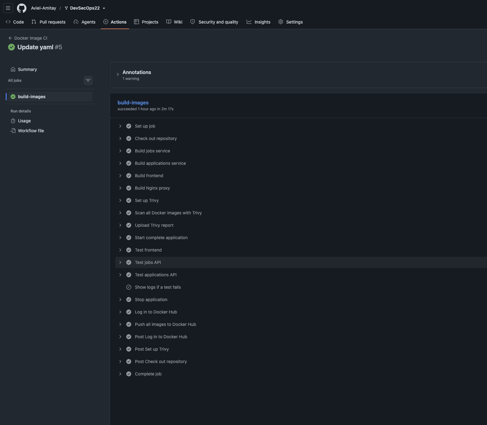
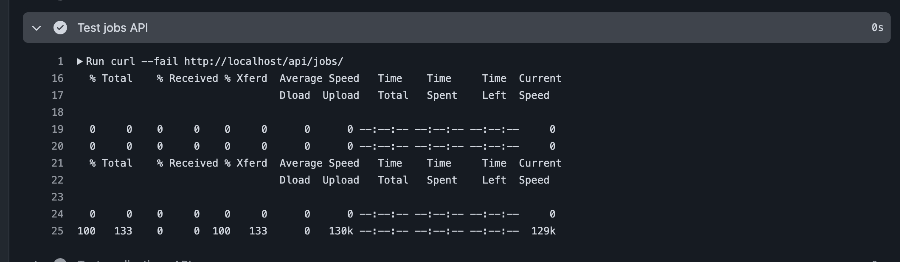

## Task 1
- Result How many CVE found with a CRITICAL -> 5

```text
lab-job-board-applications-service.txt:Total: 28 (UNKNOWN: 0, LOW: 2, MEDIUM: 8, HIGH: 17, CRITICAL: 1)
lab-job-board-jobs-service.txt:Total: 173 (UNKNOWN: 28, LOW: 66, MEDIUM: 56, HIGH: 19, CRITICAL: 4)
lab-job-board-jobs-service.txt:Total: 13 (UNKNOWN: 0, LOW: 2, MEDIUM: 8, HIGH: 3, CRITICAL: 0)
```

- The image with the most vulnerabilities is "lab-job-board-jobs-service:latest"

CVE-2026-59873
-  is a critical denial-of-service (DoS) vulnerability in node-tar, the popular tar archive manipulation library for Node.js. Versions prior to 7.5.19 fail to limit decompression ratios or track total output size, allowing a small gzip bomb to crash applications via CPU and disk exhaustion.

Aviel note - The tar tool is a popular tool that use in a lot of indstury to help and reduce size, and from that why that is critical.


## Task 1.2
1. Ensure the final image runs as a non-root user  
    ```
    docker run --rm lab-job-board-jobs-service:latest whoami appuser
    ```

    ```
    docker run --rm lab-job-board-applications-service:latest whoami appuser
    ```

2. Pin all FROM tags to an exact digest

- Command
  ```bash
  for u in `docker image ls | grep board | awk {print }` ; do docker inspect --format={{index .RepoDigests 0}}  $u  ; done
  ```
- Output  
  ```text
  lab-job-board-applications-service@sha256:703ea01e9aaf0f0c9ef48a0ec2fde27e7ed69ef287c92857a3883c9463b1d9cb
  lab-job-board-frontend@sha256:ba87f060dfd9812915007e482710c08bb705eefecc8ab0494f22fe14062cd400
  lab-job-board-jobs-service@sha256:8afb15ecaa023197fcfad9acfa495ae53f7fb328f8a4f80d7b08a7709b744aaf
  lab-job-board-nginx@sha256:ef19a27dbecde3ce99bbbfd9f18ac17b858eae7f2bb3d0372d259f03fe4755c8
  ```


3. Add a `.dockerignore` file if one is missing 
    - Added a `.dockerignore` file on the `nginx` directory

4. Add a HEALTHCHECK instruction to any Dockerfile that lacks one.  
  ```Dockerfile
  HEALTHCHECK --interval=30s --timeout=5s --start-period=10s --retries=3 \
    CMD wget -q --spider http://127.0.0.1:80/api/jobs/ || exit 1
```


- Note - I've replaced from `localhost` to `127.0.0.1`

5. Reduce the final image layer count using && chaining in RUN statements
- All `Dockerfile` files verified manually.


## Task 2

### 2.1 – Logging configuration

```bash
docker compose logs -f jobs-service | tee -a
```

### 2.2 Environment variable isolation
- Done  
	- Why? Beacuse env file contain a sensitve information like password, API keys, and when pushing it into GitHub or other provider, it expose to everyone.

### 2.3 Service restart policy and dependency ordering
- Command
    ```bash
    docker compose up --build 2>&1 | grep -iE "healthy|started|Starting"
    ```

- Output  
```text
Container jobboard-db Starting   
 Container jobboard-db Started   
jobboard-db  | 2026-08-06 14:29:08.154 UTC [1] LOG:  starting PostgreSQL 16.14 on aarch64-unknown-linux-musl, compiled by gcc (Alpine 15.2.0) 15.2.0, 64-bit  
 Container jobboard-db Healthy   
 Container jobboard-db Healthy   
 Container applications-service Starting  
 Container jobs-service Starting   
 Container jobs-service Started   
 Container applications-service Started   
jobs-service          | INFO:     Started server process [1]  
 Container applications-service Healthy   
 Container jobs-service Healthy   
 Container jobboard-frontend Starting   
 Container jobboard-frontend Started   
 Container nginx-proxy Starting   
 Container nginx-proxy Started   
```
---  

```text
postgres
├── jobs-service
│   └── frontend
└── applications-service
    └── frontend

frontend ─────────────┐
jobs-service ─────────┼──► nginx-proxy
applications-service ┘
```

- Explain what condition: service_healthy does vs condition: service_started

	- service_healthy -> Mean that the container is alive with all of the services, while service_started wait until all his dependacy start.

## Task 3

### 3.1 – Verify persistence across restarts

- Create a new job via the UI or API:
	- Fix curl code:

```bash
curl -s -X POST http://localhost/api/jobs   -H Content-Type: application/json   -d '{title:Persistence Test Job,description:Testing Docker volumes,company:Lab Inc,location:Docker}'   | python3 -m json.tool
```

- Stop and restart the containers
Done

- Verify your job still exists:
	- Remove the last backslash from the jobs/ which cause the command to failed.

```bash
curl -s http://localhost/api/jobs | python3 -m json.tool
```

- Explain the difference between docker compose down, docker compose down -v, and docker compose stop. When would you use each?
	- `docker compose down` - Mean that I'm termibate and delete the container and the network interface associate with this continers.
	- `docker compose down -v` - This is a new flag for me, after searching is to include also delete volumes.
	- `docker compose stop` - Stop the container process, NOT delete.

### 3.2 Volume inspection

- Inspect the named volume:


```bash
docker volume inspect jobboard-postgres-data
```

- **Output**

```text
[
    {
        "CreatedAt": "2026-08-06T13:00:00Z",
        "Driver": "local",
        "Labels": {
            "com.docker.compose.config-hash": "51cb1b890dca508cb1c6e869d49a43bf77eb2b579d8769998c61578da7750fb3",
            "com.docker.compose.project": "lab-job-board",
            "com.docker.compose.version": "5.2.0",
            "com.docker.compose.volume": "postgres-data"
        },
        "Mountpoint": "/var/lib/docker/volumes/jobboard-postgres-data/_data",
        "Name": "jobboard-postgres-data",
        "Options": null,
        "Scope": "local"
    }
]
```
---

```bash
docker volume ls
```

- **Output**

```text
DRIVER    VOLUME NAME
local     87fa306356983684681d90159ec692922f76ff37b071c8cbfb9f87bd57561053
local     6449742c10e189576da26c63ddb2a8ec686c4dbaa659f8c6d36babcdb837bd66
local     jenkins_home
local     jobboard-postgres-data
local     minikube
```

- Where on the host machine is the data actually stored?
	- On MacOS, volume is stored under the `~/Library/Containers/com.docker.docker/Data/vms/0/data/Docker.raw`.

- What is the difference between a named volume (postgres-data:) and a bind mount (./data:/var/lib/postgresql/data)?
	- named volume (postgres-data:) - Is a block volume
	- bind mount (./data:/var/lib/postgresql/data) - Used when I need to share data between the host <-> Container.

- When would you prefer each approach in production?
	- Depend on the container type. For example if I want to build a docker image part of a Jenkins process, I will share my docker.socket with the container.  

### 3.3 – Database backup and restore  

- Database backup

```bash
docker exec jobboard-db pg_dump \
  -U postgres \
  -d jobboard \
  --no-owner \
  --no-acl \
  -F plain > backup_$(date +%Y%m%d_%H%M%S).sql
```

- **Output**
```text
total 80
-rw-r--r--   1 aviela  staff    22K Aug  3 17:27 README.md
drwxr-xr-x   6 aviela  staff   192B Aug  3 20:43 applications-service
-rw-r--r--   1 aviela  staff   4.9K Aug  7 00:08 backup_20260807_000855.sql
-rw-r--r--@  1 aviela  staff   4.1K Aug  6 17:02 docker-compose.yml
drwxr-xr-x  12 aviela  staff   384B Aug  3 21:04 frontend
drwxr-xr-x   3 aviela  staff    96B Aug  3 17:27 init-db
drwxr-xr-x   6 aviela  staff   192B Aug  3 17:27 jobs-service
drwxr-xr-x  13 aviela  staff   416B Aug  3 17:27 k8s
drwxr-xr-x   5 aviela  staff   160B Aug  6 16:53 nginx
drwxr-xr-x   5 aviela  staff   160B Aug  7 00:08 results

aviela@MacBook-M1-Syverse lab-job-board % head -30 backup_*.sql 
grep -c "INSERT INTO" backup_*.sql >> results/SOLUTION.md
--
-- PostgreSQL database dump
--

\restrict mFMGjTmtGdw1RGEpImdWuiFHbVvu0Tmc6V68Wutms1a9pIScLacf7xjI9QNnkrL

-- Dumped from database version 16.14
-- Dumped by pg_dump version 16.14

SET statement_timeout = 0;
SET lock_timeout = 0;
SET idle_in_transaction_session_timeout = 0;
SET client_encoding = 'UTF8';
SET standard_conforming_strings = on;
SELECT pg_catalog.set_config('search_path', '', false);
SET check_function_bodies = false;
SET xmloption = content;
SET client_min_messages = warning;
SET row_security = off;

SET default_tablespace = '';

SET default_table_access_method = heap;

--
-- Name: applications; Type: TABLE; Schema: public; Owner: -
--

CREATE TABLE public.applications (
    id uuid NOT NULL,
```

#### Restore validation on a fresh database

The `init-db/init.sql` file normally creates the tables and seed data when
PostgreSQL starts with an empty data volume. To prove that the backup itself
restores both the schema and the data, I temporarily commented out its bind
mount in `docker-compose.yml`:

```yaml
volumes:
  - postgres-data:/var/lib/postgresql/data
  # - ./init-db/init.sql:/docker-entrypoint-initdb.d/01-init.sql:ro
```

I then removed the existing database volume and started only PostgreSQL. The
`-v` option is destructive and was used here intentionally to create a clean restore test environment without any existing volumes.

```bash
docker compose down -v
docker compose up -d --wait postgres
```

The `POSTGRES_DB` setting still creates the empty `jobboard` database. Before
restoring the backup, I verified that it contained no tables:

```bash
docker exec jobboard-db \
  psql -U postgres -d jobboard \
  -c "\\dt"
```

Expected result:

```text
Did not find any relations.
```

Next, I copied the SQL backup into the container and restored it with `psql`.
`ON_ERROR_STOP=1` makes the command fail immediately if any SQL statement
cannot be restored.

```bash
docker cp backup_20260807_000855.sql jobboard-db:/tmp/backup.sql

docker exec jobboard-db \
  psql -v ON_ERROR_STOP=1 \
  -U postgres \
  -d jobboard \
  -f /tmp/backup.sql
```

- Finally, I verified that the backup recreated the tables and restored their
records:

	- Connect into the Docker container.

	```bash
	docker exec -it jobboard-db psql -U postgres -d jobboard 
	```
	- Inside the `psql` run:  

	```psql
	\conninfo
	\dt
	SELECT COUNT(*) FROM jobs;
	SELECT COUNT(*) FROM applications;
	SELECT id, title, company FROM jobs;
	```

- Expect output:

```text
aviela@MacBook-M1-Syverse lab-job-board % docker exec -it jobboard-db psql -U postgres -d jobboard        
psql (16.14)
Type "help" for help.

jobboard=# \conninfo
You are connected to database "jobboard" as user "postgres" via socket in "/var/run/postgresql" at port "5432".
jobboard=# \dt
            List of relations
 Schema |     Name     | Type  |  Owner   
--------+--------------+-------+----------
 public | applications | table | postgres
 public | jobs         | table | postgres
(2 rows)

jobboard=# 
jobboard=# SELECT COUNT(*) FROM jobs;
 count 
-------
     8
(1 row)

jobboard=# SELECT COUNT(*) FROM applications;
 count 
-------
     0
(1 row)

jobboard=# 
jobboard=# SELECT id, title, company FROM jobs;
                  id                  |             title             |      company      
--------------------------------------+-------------------------------+-------------------
 job-001                              | Senior DevOps Engineer        | TechCorp Ltd.
 job-002                              | Backend Developer (Python)    | StartupXYZ
 job-003                              | Cloud Architect               | CloudSystems Inc.
 job-004                              | Frontend Engineer (React)     | ProductLab
 job-005                              | Security Engineer (DevSecOps) | SecureOps
 64b6ab68-f446-4e36-a072-4272c52eb411 | DevOps                        | Any
 a242de03-34bb-40aa-acdf-548b5b8f2cc1 | Persistence Test Job          | Lab Inc
 baaf57c9-b032-470a-a56e-e1ca6fa2982f | Persistence Test Job          | Lab Inc
(8 rows)

jobboard=# 
jobboard=# \q
```

After completing the validation, I uncommented the normal initialization mount
in `docker-compose.yml` and started the complete application:

```yaml
volumes:
  - postgres-data:/var/lib/postgresql/data
  - ./init-db/init.sql:/docker-entrypoint-initdb.d/01-init.sql:ro
```

```bash
docker compose up -d
docker compose ps
```

Because the restored PostgreSQL volume is no longer empty, re-enabling the
mount does not execute `init.sql` again. PostgreSQL initialization scripts run
only when the data directory is empty.

---

## Task 4

### 4.1 – Fork and set up the repository 
- Done

### 4.2 – Trigger and verify the pipeline 

- GitHub Action: https://github.com/Aviel-Amitay/DevSecOps22/actions/runs/31411321092/job/93529817400

- Docker Hub: https://hub.docker.com/repository/docker/aviel770/lab-job-board/tags  



### 4.3 – Add a test 

- Added four tests under `jobs-service/tests/test_main.py`:
  - `GET /health` returns status `200` and `status: healthy`.
  - `POST /jobs/` with valid data returns status `201`.
  - `POST /jobs/` with missing fields returns status `422`.
  - `GET /jobs/{id}` with a missing ID returns status `404`.

- Run the tests inside the built image so no local Python installation is
  required:

```bash
docker compose build jobs-service

docker run --rm \
  -e PYTHONPATH=/app \
  -v "$PWD/jobs-service/tests:/app/tests:ro" \
  -w /app \
  lab-job-board-jobs-service:latest \
  pytest tests -q
```

- Result:

```text
....                                                                     [100%]
4 passed in 0.42s
```

- The tests do not require PostgreSQL. They set `DATABASE_URL=sqlite://` before
  importing the application and replace FastAPI's `get_db` dependency with a
  `MagicMock`. This lets the CI pipeline test the API responses without a real
  database connection.



---

## Task 5

### 5.1 – Understand the Docker network

- I inspected the network and formatted the output to show each container name
  and IP address:  
  
```bash
docker network inspect jobboard-network \
  --format '{{range .Containers}}{{.Name}} {{.IPv4Address}}{{println}}{{end}}'
  ```

- List all containers on the network with their IP addresses:  


```text
jobboard-db           172.20.0.2/16
jobs-service         172.20.0.3/16
applications-service 172.20.0.4/16
jobboard-frontend     172.20.0.5/16
nginx-proxy           172.20.0.6/16
```

- Explain how jobs-service resolves the hostname postgres (Docker's embedded DNS)

  - Docker Compose connects both containers to `jobboard-network`, because on the default bridge, we don't have resolve DNS, so we can't reach the postgress DB.

- What happens if you try to reach jobs-service:8000 from your browser directly? Why?

  - It fails because jobs-service is a hostname available only inside the Docker network.
  - Port `8000` is not published to the host machine.
  - The browser must use `http://localhost/api/jobs/`, which goes through the
    Nginx reverse proxy.

- Note: The commiunication between container done with the service, due if we terminate and reapply the `docker compose`,  IP addresses might changed after recreating the network.  

### 5.2 – Inter-service communication test

- Test the PostgreSQL connection from `jobs-service`:

```bash
docker exec jobs-service python3 -c "
import psycopg2
from app.database import DATABASE_URL
conn = psycopg2.connect(DATABASE_URL)
print('Connected to PostgreSQL:', conn.get_dsn_parameters())
conn.close()
"
```

- Output:

```text
Connected to PostgreSQL: {'user': 'postgres', 'channel_binding': 'prefer', 'dbname': 'jobboard', 'host': 'postgres', 'port': '5432'
```

- The connection succeeded through the private Docker network. The Python
  service constructs `DATABASE_URL` from the mounted password secret.

- Test communication with the applications service:

```bash
docker exec jobs-service python3 -c "
import urllib.request
print(urllib.request.urlopen(
    'http://applications-service:3001/health'
).read().decode())
"
```

- Output:

```json
{"status":"healthy","service":"applications-service","version":"1.0.0"}
```

### 5.3 – Nginx routing analysis

- Request:

```text
Browser -> POST http://localhost/api/applications/
```

1. Which Nginx location block matches?

   - Nginx receives the request on port `80` and matches the location defined
     in [nginx/nginx.conf](./nginx/nginx.conf):

   ```nginx
   location /api/applications {
       limit_req zone=api burst=20 nodelay;

       rewrite ^/api/applications/(.*) /applications/$1 break;
       rewrite ^/api/applications$     /applications    break;

       proxy_pass         http://applications_service;
       proxy_http_version 1.1;
       proxy_set_header   Host              $host;
       proxy_set_header   X-Real-IP         $remote_addr;
       proxy_set_header   X-Forwarded-For   $proxy_add_x_forwarded_for;
       proxy_read_timeout 30s;
   }
   ```

2. What does the rewrite rule transform the path to?

   ```text
   /api/applications/ -> /applications/
   ```

3. Which upstream container receives the request and on which port?

   - `proxy_pass http://applications_service` sends the request to the
     `applications-service` container on port `3001`.

4. How does the response travel back to the browser?

   - Express processes the POST request and sends its response to Nginx. Nginx
     then returns the status, headers, and body to the browser.

   ```text
   Browser -> nginx:80 -> applications-service:3001 -> nginx -> Browser
   ```

---

## Task 6 (Bonus)

### 6.1 – Docker secrets

The Compose stack defines `db_password` from the Git-ignored
`db_password.txt` file and mounts it read-only at
`/run/secrets/db_password` in PostgreSQL and both API containers. PostgreSQL
uses `POSTGRES_PASSWORD_FILE`. The Python and Node services read the same file
at startup, URL-encode the value, and construct their database URLs internally.

Setup and verification:

```bash
cp db_password.txt.example db_password.txt
docker compose up --build -d
docker compose exec postgres test -r /run/secrets/db_password
docker compose exec jobs-service test -r /run/secrets/db_password
docker compose exec applications-service test -r /run/secrets/db_password
```

- `db_password.txt` is intentionally excluded by `.gitignore`, as it include a password.
- A dummy file [./db_password.txt.example](./db_password.txt.example) is available to copy as `./db_password.txt` file.  

### 6.2 – Content Security Policy

Update `nginx/nginx.conf` to add a `Content-Security-Policy` header that:

- Allows scripts only from `self`
- Allows styles from `self` and inline
- Blocks all `frame-ancestors`

```bash
aviela@MacBook-M1-Syverse lab-job-board % curl -sI http://localhost | grep -i content-security
```
- Output  
```text
Content-Security-Policy: default-src 'self'; script-src 'self'; style-src 'self' 'unsafe-inline'; frame-ancestors 'none'
aviela@MacBook-M1-Syverse lab-job-board % 
```